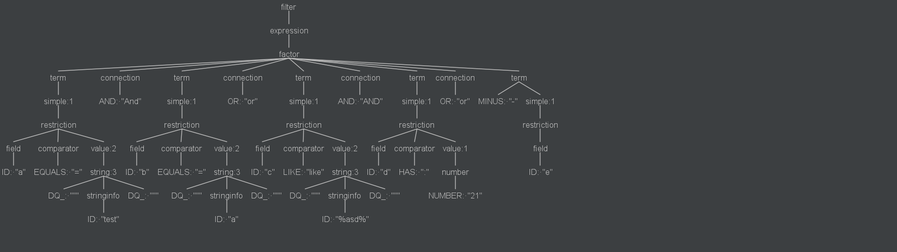

### api参考文档

> [AIP-160: Filtering](https://google.aip.dev/160)

### 仓库

> [mybatis-plus-filter: mybatis plus 的查询增强工具，无倾入，使用简单，帮你实现强大的查询api (gitee.com)](https://gitee.com/liupengss/mybatis-plus-filter)

### 适用范围和目标

> 适用于前端或者open api多条件的mysql列表查询。把复杂的查询的条件构造交给前端，让接口更加灵活，同时后端也要能控制查询的字段，限制字段能处理的操作，保证sql的性能和防止sql注入。

### 解析规则

> 1. 支持 **=**、**!=**、**<**、**>**、**<=**、**>=** 类似原生sql
> 2. 支持**is NOT NULL** 和 **is NULL** , 类似原生sql
> 3. 支持**like**,类原生sql
> 4. 支持in语句，**a:‘34,12’** 表示a字段包含34和12
> 5. 不支持函数(可以后续增强)
> 6. 不支持字段嵌套(字段用java类控制) 如 a.b.c
> 7. 支持多条件嵌套，如 (a and b) or c 

### 实现

> #### mybatis plus 注入filter sql

> - SearchBean 定义查询
>
>    filterBean 主要是为了定义查询的返回数据结构，查询中使用的数据表，filter中能使用的字段已经字段的使用限制。
>
>   - @SearchBean注解 作用与类
>
>     - tables 定义查询所用的表 （支持多表），如（table a left join table b on [a.id](http://a.id) = b.aId ） 将直接插入sql 语句中
>     - autoMapTo 多表时，没有使用@DbField注解制定表名的字段，会默认作为autoMapTo值所对应表的字段
>
>   - @DbField注解
>
>     - value 定义指定 在sql中所表示的字段，值如：[u.name](http://u.name)，未填写是，默认值为字段名的驼峰转下划线
>
>     - conditional 定义此字段是否能作为检索条件，默认为true，当一个字段只想返回时携带并且不能作为查询条件时使用
>
>     - onlyOn 表示当前字段允许的操作符，默认为全支持
>
>       可定义操作符
>
>       ```java
>       package com.pzhu.filter.enums;
>       
>       /**
>        * 过滤运算符
>        *
>        */
>       public enum Operator {
>           /**
>            * 等于
>            */
>           EQUAL,
>       
>           /**
>            * 大于等于
>            */
>           GREATER_EQUAL,
>       
>           /**
>            * 大于
>            */
>           GREATER_THAN,
>       
>           /**
>            * 小于等于
>            */
>           LESS_EQUAL,
>       
>           /**
>            * 小于
>            */
>           LESS_THAN,
>       
>           /**
>            * 不等于
>            */
>           NOT_EQUAL,
>       
>           /**
>            * 包含
>            * like '%xxx%'
>            */
>           CONTAIN,
>       
>           /**
>            * 以 .. 开始
>            * like 'xxx%'
>            */
>           START_WITH,
>       
>           /**
>            * 以 .. 结束
>            * like '%xxx'
>            */
>           END_WITH,
>       
>           /**
>            * 表示字段可以 使用 is NULL 或者 is NOT NULL
>            */
>           NULL,
>       
>           /**
>            * 多值
>            * in
>            */
>           MULTI_VALUE;
>       
>       
>           public static Operator from(Object op) {
>               if (op == null) {
>                   return null;
>               }
>               if (op instanceof Operator) {
>                   return (Operator) op;
>               }
>               switch (op.toString()) {
>                   case "=":
>                       return EQUAL;
>                   case ">=":
>                       return GREATER_EQUAL;
>                   case ">":
>                       return GREATER_THAN;
>                   case "<=":
>                       return LESS_EQUAL;
>                   case "<":
>                       return LESS_THAN;
>                   case "!=":
>                       return NOT_EQUAL;
>                   case "like":
>                   case "LIKE":
>                       return CONTAIN;
>                   case "start with":
>                       return START_WITH;
>                   case "end with":
>                       return END_WITH;
>                   case "is NOT NULL":
>                   case "is NULL":
>                       return NULL;
>                   case ":":
>                       return MULTI_VALUE;
>                   default:
>                       return null;
>               }
>           }
>       
>       }
>       ```
>
>       
>
>     - ```
>       convertClass 自定义转化的工具类（负责将filter里的value的字符串翻译为对象）一般情况已经实现 转化工具类
>       ```
>
>   - @CanOrderBy注解表示该字段可以用于排序
>
>   示例：
>
>   ```java
>   @Data
>   @SearchBean(tables = "user u", autoMapTo = "u")
>   public class UserSearch {
>   
>       @DbField(value = "u.name", onlyOn = {Operator.NULL, Operator.START_WITH, Operator.EQUAL,Operator.START_WITH})
>       @CanOrderBy
>       private String name;
>   
>       @CanOrderBy
>       private int age;
>   
>       private Instant dateCreated;
>   }
>   ```
>
>   
>
>   
>
> - 在mapper中定义好查询方法，并在方法上标记@SearchMapper注解，并指定SearhBean的定义类，使用注解后，项目启动过程中会为这个方法自动注入sql,不用在xml中定义具体sql
>
>   ```java
>       @SearchMapper(value = UserSearch.class)
>       List<UserSearch> testSearch(@Param(SearchWrapper.SEARCH_WRAPPER) SearchWrapper searchWrapper);
>   
>       @SearchMapper(value = UserSearch.class, isCount = true)
>       Long count(@Param(SearchWrapper.SEARCH_WRAPPER) SearchWrapper searchWrapper);
>   
>       @SearchMapper(value = UserSearch.class)
>       Page<UserSearch> testSearch(@Param(SearchWrapper.SEARCH_WRAPPER) SearchWrapper searchWrapper, Page<UserSearch> page);
>   ```

> #### antlr 解析 filter 规则
>
> 
>
> #### 字段过滤
>
> - 对字段类型过滤，判断字段是否在searchBean中存在，有则继续判断操作符是否在操作范围内，如果不满足，剔除条件
>
> - 对value 进行相应的类型转化，需要自己定义的话，需要在DbField注解的指定转化的类。
>
>   默认支持：
>
>   ```java
>   package com.pzhu.filter.filter;
>   
>   import com.pzhu.filter.function.Convert;
>   
>   import java.math.BigDecimal;
>   import java.time.Instant;
>   import java.time.LocalDate;
>   import java.time.LocalDateTime;
>   import java.util.concurrent.ConcurrentHashMap;
>   
>   public class ConvertUtils {
>   
>       private static final ConcurrentHashMap<Class<?>, Class<? extends Convert<?>>> convertMap = new ConcurrentHashMap<>();
>   
>       static {
>           convertMap.put(String.class, StringConvert.class);
>           convertMap.put(Long.class, LongConvert.class);
>           convertMap.put(long.class, LongConvert.class);
>           convertMap.put(Byte.class, ByteConvert.class);
>           convertMap.put(byte.class, ByteConvert.class);
>           convertMap.put(Integer.class, IntegerConvert.class);
>           convertMap.put(int.class, IntegerConvert.class);
>           convertMap.put(BigDecimal.class, BigDecimalConvert.class);
>           convertMap.put(Double.class, DoubleConvert.class);
>           convertMap.put(double.class, DoubleConvert.class);
>           convertMap.put(Float.class, FloatConvert.class);
>           convertMap.put(float.class, FloatConvert.class);
>           convertMap.put(LocalDateTime.class, LocalDateTimeConvert.class);
>           convertMap.put(LocalDate.class, LocalDateConvert.class);
>           convertMap.put(Boolean.class, BooleanConvert.class);
>           convertMap.put(boolean.class, BooleanConvert.class);
>           convertMap.put(Short.class, ShortConvert.class);
>           convertMap.put(short.class, ShortConvert.class);
>           convertMap.put(Instant.class, InstantConvert.class);
>       }
>   
>       public static class StringConvert implements Convert<String> {
>           @Override
>           public String convert(String text) {
>               return text;
>           }
>       }
>   
>   
>       public static class LongConvert implements Convert<Long> {
>   
>           @Override
>           public Long convert(String text) {
>               return Long.valueOf(text);
>           }
>       }
>   
>       public static class ByteConvert implements Convert<Byte> {
>   
>           @Override
>           public Byte convert(String text) {
>               return Byte.valueOf(text);
>           }
>       }
>   
>       public static class IntegerConvert implements Convert<Integer> {
>   
>           @Override
>           public Integer convert(String text) {
>               return Integer.valueOf(text);
>           }
>       }
>   
>       public static class BigDecimalConvert implements Convert<BigDecimal> {
>   
>           @Override
>           public BigDecimal convert(String text) {
>               return new BigDecimal(text);
>           }
>       }
>   
>       public static class DoubleConvert implements Convert<Double> {
>   
>           @Override
>           public Double convert(String text) {
>               return Double.valueOf(text);
>           }
>       }
>   
>       public static class FloatConvert implements Convert<Float> {
>           @Override
>           public Float convert(String text) {
>               return Float.valueOf(text);
>           }
>       }
>   
>       public static class LocalDateTimeConvert implements Convert<LocalDateTime> {
>           @Override
>           public LocalDateTime convert(String text) {
>               return LocalDateTime.parse(text);
>           }
>       }
>   
>       public static class LocalDateConvert implements Convert<LocalDate> {
>   
>           @Override
>           public LocalDate convert(String text) {
>               return LocalDate.parse(text);
>           }
>       }
>   
>       public static class BooleanConvert implements Convert<Boolean> {
>   
>           @Override
>           public Boolean convert(String text) {
>               return Boolean.parseBoolean(text);
>           }
>       }
>   
>       public static class ShortConvert implements Convert<Short> {
>           @Override
>           public Short convert(String text) {
>               return Short.valueOf(text);
>           }
>       }
>   
>       public static class InstantConvert implements Convert<Instant> {
>           @Override
>           public Instant convert(String text) {
>               return Instant.parse(text);
>           }
>       }
>   
>       public static Convert<?> of(Class<?> fieldType) {
>           try {
>               final Class<? extends Convert<?>> aClass = convertMap.get(fieldType);
>               if (aClass != null) {
>                   return aClass.newInstance();
>               }
>           } catch (InstantiationException | IllegalAccessException e) {
>               throw new ClassCastException();
>           }
>           return null;
>       }
>   
>   }
>   ```
>
>   
>
> #### 条件处理器加载filter
>
> 为了防止sql注入，使用一个SearchWrapper类来包装查询条件，它由一个HashMap来存储条中的条件，key为条件序号，value为真正的值，sql 预编译是并不会value并不会直接拼接在sql中。

### Filter 使用

> #### 1.定义searchBean
>
> ```java
> @Data
> @SearchBean(tables = "user u ", autoMapTo = "u")
> public class UserSearch {
> 
>     @DbField(value = "u.name", onlyOn = {Operator.NULL, Operator.START_WITH, Operator.EQUAL,Operator.START_WITH})
>     @CanOrderBy
>     private String name;
> 
>     @CanOrderBy
>     private int age;
> 
>     private Instant dateCreated;
> }
> ```
>
> #### 2.定义Mapper方法
>
> ```java
> @SearchMapper(value = UserSearch.class)
> List<UserSearch> testSearch(@Param(SearchWrapper.SEARCH_WRAPPER) SearchWrapper searchWrapper);
> 
> @SearchMapper(value = UserSearch.class, isCount = true)
> Long count(@Param(SearchWrapper.SEARCH_WRAPPER) SearchWrapper searchWrapper);
> 
> @SearchMapper(value = UserSearch.class)
> Page<UserSearch> testSearch(@Param(SearchWrapper.SEARCH_WRAPPER) SearchWrapper searchWrapper, Page<UserSearch> page);
> ```
>
> #### 3.使用QueryConditions封装
>
> ```java
>  String filter = " name like 'tes%' AND dateCreated >'2017-11-27T03:16:03.94Z'";
>  String orderBy  = "name desc,age";
>  final QueryConditions queryConditions = new QueryConditions();
>  queryConditions.setOrderBy(orderBy);
>  queryConditions.setFilter(filter);
>  final SearchWrapper searchWrapper = queryConditions.createSearchWrapper(UserSearch.class);
>  System.out.println(searchWrapper.getSqlSegment());
>  final List<UserSearch> userSearches = userMapper.testSearch(searchWrapper);
> ```

### 问题

> #### **1.分页怎么解决**
>
> 分页仍然可以使用之前的用法
>
> ```java
> @SearchMapper(value = UserSearch.class) 
> Page<UserSearch> testSearch(@Param(SearchWrapper.SEARCH_WRAPPER) SearchWrapper searchWrapper,Page<UserSearch> page);
> ```
>
> #### **2.count 查询处理**
>
> count 查询只需将 SearchMapper 的 isCount设为true,返回值为Long，count语句去剔除order by
>
> ```java
> @SearchMapper(value = UserSearch.class,isCount = true) 
> Long count(@Param(SearchWrapper.SEARCH_WRAPPER) SearchWrapper searchWrapper);
> ```
>
> #### **3.on 语句 添加条件**
>
> on语句中设置好参数，在**searchWrapper**中添加好参数就行
>
> ```java
> // 设置参数 
> @SearchBean(tables =  "user u left join user_role ur on u.id = ur.user_id and " +     "ur.last_updated>#{ew.paramNameValuePairs."+ UserVo.LAST_UPDATE+"} left join role r  on ur.role_id = r.id ", autoMapTo = "u") 
> // 添加 
> final SearchWrapper searchWrapper = queryConditions.createSearchWrapper(UserVo.class); searchWrapper.getParamNameValuePairs().put(UserVo.LAST_UPDATE,LocalDateTime.now());
> ```
>
> 